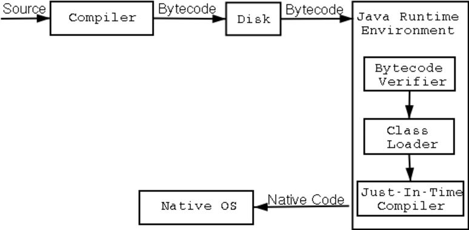
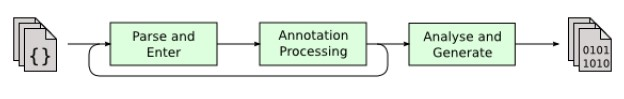
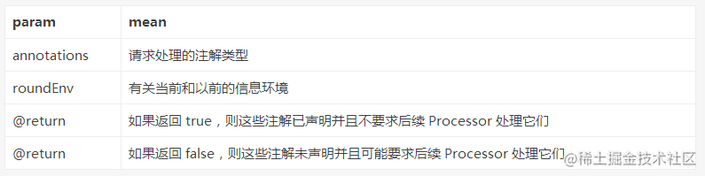
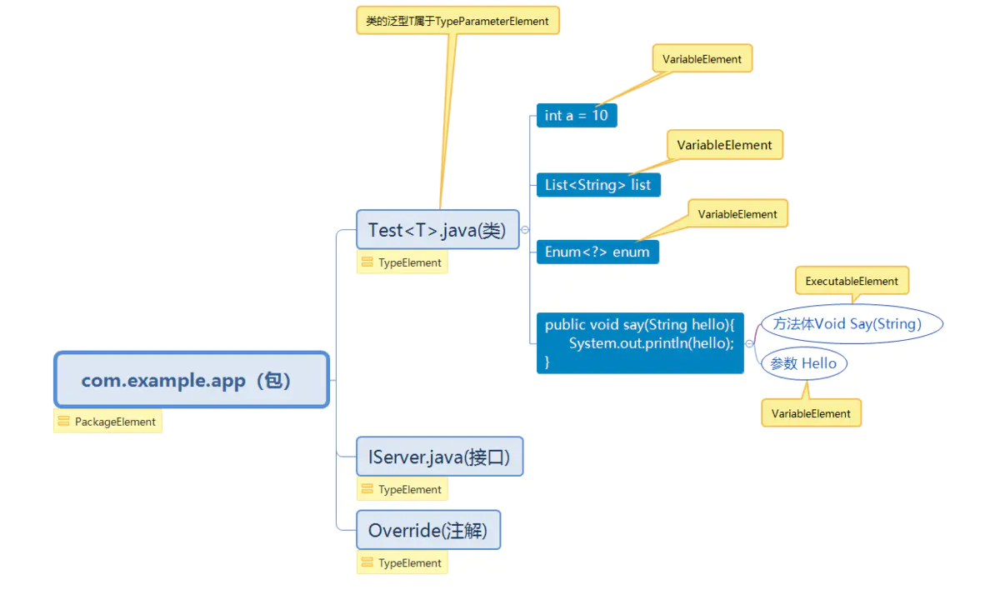

# 什么是Processor

AbstractProcessor是一个抽象类，它的父类是Processer。翻阅了网上大部分文章，基本没有一个很好的对这个类的一个描述。我最后找到了Java的Api Doc文档，其中有对这个类的一些说明。

**Processor释义**

```
 注释处理按照rounds的顺序进行。 在每一轮中，可以向处理器询问process在前一轮产生的源文件和类文件上找到的注释的子集。 第一轮处理的输入是工具运行的初始输入; 这些初始输入可以被视为虚拟第0轮处理的输出。 如果要求处理器在给定轮次上进行处理，则会要求处理后续轮次，包括最后一轮，即使没有要处理的注释。 工具基础结构还可以要求处理器处理由工具的操作隐式生成的文件。
```

简单的说就是Processor会在编译阶段初始化，然后对当前模块内的代码进行一次扫描，然后获取到对应的注解，之后调用process方法，然后我们根据这些注解类来做一些后续操作。


**Java编译流程**




上图是一张简单的编译流程图，compiler代表我们的javac([java语言编程编译器](https://baike.baidu.com/item/javac/5156702?fr=aladdin))。这张图应该中其实缺少了一个流程，在source -> complier的过程中就应该把我们的Processor补充上去。



把两张图结合就是整个java的编译流程了。整个编译过程就是 **source(源代码) -> processor（处理器） -> generate （文件生成）-> javacompiler -> .class文件 -> .dex(只针对安卓)。**


# ProcessingEnvironment

这个类很重要，要考的。这个类会在函数init的时候被传入，主要的工具类方法都在这个类上。

```java
public interface ProcessingEnvironment {
    Map getOptions();

    Messager getMessager();

    Filer getFiler();

    Elements getElementUtils();

    Types getTypeUtils();

    SourceVersion getSourceVersion();

    Locale getLocale();
}
 
```

Filer 就是文件流输出路径，当我们用AbstractProcess生成一个java类的时候，我们需要保存在Filer指定的目录下。

Messager 输出日志工具，需要输出一些日志相关的时候我们就要使用这个了。

Elements 获取元素信息的工具，比如说一些类信息继承关系等。

Types 类型相关的工具类，processor java代码不同的是，当process执行的时候，class的由于类并没有被传递出来，所以大部分都行都是用element来代替了，所以很多类型比较等等的就会转化成type相关的进行比较了。

类型相关的都被转化成了一个叫TypeMirror，其getKind方法返回类型信息，其中包含了基础类型以及引用类型。

举个简单的例子，当一个实现了注解的Element被传入的时候，我们要判断Element是不是实现了特定接口，那么应该如何做呢？

```java
    private Elements elementUtils;
    private Types types;
    
    @Override
    public synchronized void init(ProcessingEnvironment processingEnv) {
        super.init(processingEnv);
        types = processingEnv.getTypeUtils();
        elementUtils = processingEnv.getElementUtils();
    }
    
    public boolean isSubType(Element element, String className) {
        return element != null && isSubType(element.asType(), className);
    }
    
    public TypeMirror typeMirror(String className) {
        return typeElement(className).asType();
    }
    
    public TypeElement typeElement(String className) {
        return elementUtils.getTypeElement(className);
    }
    
    public boolean isSubType(TypeMirror type, String className) {
        return type != null && types.isSubtype(type, typeMirror(className));
    }
复制代码
```

**其中isSubType方法是判断传入的Element是不是一个接口的实现类。首先我们要将对象都转化成Element, 然后将两个element转化成TypeMirror，之后调用Types的isSubtype方法对两个TypeMirror进行比较，如果发现类型一样，则该输入的Element是特定接口的实现类。**


# process

扫描代码的时候会把当前获取到的annotations传入当前方法。一个模块的processer可能会有多个。其中process方法返回值返回true ，则声明注释类型，并且不会要求后续处理器处理它们; 如果返回false ，则注释类型无人认领，可能会要求后续处理器处理它们。


**Processor方法：**

**1，Iterable ：getCompletions(Element element, AnnotationMirror annotation, ExecutableElement member, String userText)**

返回一个空的迭代


**2，Set：getSupportAnnotationTypes()** 

注解其所支持的注解类型集合。


**3，Set：getSupportedOptions()** 

返回具有与批注相同的字符串集的不可修改集


**4，getSupportedSourceVersion()**

指定使用的Java版本，通常返回SouceVersion.latesSupported()。

**5，init(ProcessingEnvironment processingEnv)** 

会被注解处理工具调用，processingEnv提供很多有用的工具类Elements，Types和Filer


**6，process(Set annotations, RoundEnvironment roundEnv)**

相当于每个注解处理器的主函数，在这里执行扫描，处理主机代码，以及生成Java文件




## Element

element是代表程序的一个元素，这个元素可以是：包、类/接口、属性变量、方法/方法形参、泛型参数。

process方法的核心便是`Element`对象，所以在讲解注解处理器前，需要对`Element`有全面的认识，方能事半功倍。

由于`Element`的知识内容的复杂性，这里重点讲解核心内容，基本使用完全是足够了


```java
public interface Element extends AnnotatedConstruct {
    TypeMirror asType();

    ElementKind getKind();

    Set<Modifier> getModifiers();

    Name getSimpleName();

    Element getEnclosingElement();

    List<? extends Element> getEnclosedElements();

    boolean equals(Object var1);

    int hashCode();

    List<? extends AnnotationMirror> getAnnotationMirrors();

    <A extends Annotation> A getAnnotation(Class<A> var1);

    <R, P> R accept(ElementVisitor<R, P> var1, P var2);
}
```

可看出其实`Element`是定义的一个接口，定义了外部调用暴露出的接口

| 方法                       | 解释                                                         |
| -------------------------- | ------------------------------------------------------------ |
| getKind                    | 返回此元素的种类：包、类、接口、方法、字段...,如下枚举值     |
| asType返回此元素定义的类型 | 返回此元素定义的类型                                         |
| getModifiers               | 返回此元素的修饰符,如下枚举值                                |
| getSimpleName              | 返回此元素的简单名称,比如activity名                          |
| getEnclosingElement        | 返回封装此元素的最里层元素，如果此元素的声明在词法上直接封装在另一个元素的声明中，则返回那个封装元素； 如果此元素是顶层类型，则返回它的包如果此元素是一个包，则返回 null； 如果此元素是一个泛型参数，则返回 null. |
| getAnnotation              | 返回此元素针对指定类型的注解（如果存在这样的注解），否则返回 null。注解可以是继承的，也可以是直接存在于此元素上的 |


### `getKind`方法

其中`getKind`方法比较特殊，`getKind()`方法来获取具体的类型，方法返回一个枚举值`TypeKind`

```java
public enum TypeKind {  
    /** The primitive type {@code boolean}. */  
    BOOLEAN,  
    /** The primitive type {@code byte}. */  
    BYTE,  
    /** The primitive type {@code short}. */  
    SHORT,  
    /** The primitive type {@code int}. */  
    INT,  
    /** The primitive type {@code long}. */  
    LONG,  
    /** The primitive type {@code char}. */  
    CHAR,  
    /** The primitive type {@code float}. */  
    FLOAT,  
    /** The primitive type {@code double}. */  
    DOUBLE,  
    /** The pseudo-type corresponding to the keyword {@code void}. */  
    VOID,  
    /** A pseudo-type used where no actual type is appropriate. */  
    NONE,  
    /** The null type. */  
    NULL,  
    /** An array type. */  
    ARRAY,  
    /** A class or interface type. */  
    DECLARED,  
    /** A class or interface type that could not be resolved. */  
    ERROR,  
    /** A type variable. */  
    TYPEVAR,  
    /** A wildcard type argument. */  
    WILDCARD,  
    /** A pseudo-type corresponding to a package element. */  
    PACKAGE,  
    /** A method, constructor, or initializer. */  
    EXECUTABLE,  
    /** An implementation-reserved type. This is not the type you are looking for. */  
    OTHER,  
    /** A union type. */  
    UNION,  
    /** An intersection type. */  
    INTERSECTION;  
}
```


### <R,P> R `accept(ElementVisitor<R,P> v, P`

接收一个ElementVisitor类，它的作用类似于一个`if(element instanceof ExecutableElement)` 则调用 `visitExecutable(ExecutableElement executableElement, Void aVoid)`;两个泛型一般写Void就行，如果需要接收accept方法的返回值，则根据返回值的类型定义R，P基本上是用不到的，写Void就行

```java
element.accept(new SimpleElementVisitor7<Void, Void>() {
                @Override
                public Void visitType(TypeElement typeElement, Void aVoid) {
                    return super.visitType(typeElement, aVoid);
                    //这是一个TypeElement
                }

                @Override
                public Void visitExecutable(ExecutableElement executableElement, Void aVoid) {
                    return super.visitExecutable(executableElement, aVoid);
                    //这是一个executableElement
                }

                @Override
                public Void visitPackage(PackageElement packageElement, Void aVoid) {
                    return super.visitPackage(packageElement, aVoid);
                    //这是一个PackageElement
                }

            }, null);
```

 

### TypeMirror `asType()`

返回一个`TypeMirror`是元素的类型信息，包括包名，类(或方法，或参数)名/类型，在生成动态代码的时候，我们往往需要知道变量/方法参数的类型，以便写入正确的类型声明

```java
 for (Element element : elements) {
            if (element instanceof TypeElement) {

                TypeName typeName = ClassName.get(element.asType());

                TypeSpec typeSpec = TypeSpec.classBuilder("GenerateTest")
                        .addField(typeName, "test")
                       //添加泛型信息
                       .addTypeVariable(TypeVariableName.get(((TypeElement) element).getTypeParameters().get(0)))
                        .build();

                try {
                    JavaFile.builder("com.test", typeSpec)
                            .build()
                            .writeTo(processingEnv.getFiler());
                } catch (IOException e) {
                    e.printStackTrace();
                }
            }
        }

//===================生成代码


package com.test;
//通过ClassName包装之后，在生成对应代码中会自动导入类型的包
import com.lu.aptdemo.Test;

class GenerateTest<T> {
  Test<T> test;
}

```


### <A extends Annotation> A `getAnnotation(Class<A> annotationType)`

根据传入的注解类型获取该元素上的注解


### List<? extends AnnotationMirror> `getAnnotationMirrors()`

获取该元素上的注解的类型信息，`AnnotationMirror`类似于TypeMirror


### List<? extends Element> `getEnclosedElements()`

返回该元素直接包含的子元素,通常对一个`PackageElement`而言，它可以包含`TypeElement`；对于一个`TypeElement`而言，它可能包含属性`VariableElement`，方法`ExecutableElement`,


 

```java
 Set<? extends Element> elements = roundEnvironment.getElementsAnnotatedWith(AAAAA.class);
        //这个是我封装的一个简单的工具
        ProcessorTool tool = new ProcessorTool(processingEnv);
        for (Element element : elements) {
            if (element instanceof TypeElement) {
                 for (Element element1 : element.getEnclosedElements()) {
                    tool.addArgs(element1.getSimpleName().toString());
                }
            } 
        }
        tool.printLog();
        
//输出 Test类包含构造方法，属性Hello  方法say()

class Logger {
  void test() {
    String arg0="<init>";
    String arg1="hello";
    String arg2="say";
  }
}
        
```

### Element  getEnclosingElement()

返回包含该element的父element，与上一个方法相反，`VariableElement`，方法`ExecutableElement`的父级是`TypeElemnt`，而`TypeElemnt`的父级是PackageElment

 

```java
Set<? extends Element> elements = roundEnvironment.getElementsAnnotatedWith(AAAAA.class);
        //这个是我封装的一个简单的工具
        ProcessorTool tool = new ProcessorTool(processingEnv);
        for (Element element : elements) {
            tool.addArgs(element.getSimpleName().toString()+".getEnclosingElement(): "+element.getEnclosingElement().getSimpleName().toString());
        }
        tool.printLog();

//输出代码

class Logger {
  void test() {
    String arg0="Test.getEnclosingElement(): aptdemo";
    String arg1="hello.getEnclosingElement(): Test";
    String arg2="say.getEnclosingElement(): Test";
    String arg3="arg1.getEnclosingElement(): say";
  }
}

```

### Set<Modifier> `getModifiers()`

获取修饰关键字,入public static final等关键字


### Name  getSimpleName()

获取名字，不带包名


### Name `getQualifiedName()`

**这个方法是element的子接口所带的方法，element本身并不指代具体的元素，因此没有改方法**。获取全限定名，如果是类的话，包含完整的报名路径


### `Element`子类

`Element` 有五个直接子接口，它们分别代表一种特定类型的元素

| **Tables**           | **Are**                                                      |
| -------------------- | ------------------------------------------------------------ |
| TypeElement          | 一个类或接口程序元素                                         |
| VariableElement      | 一个字段、enum 常量、方法或构造方法参数、局部变量或异常参数  |
| ExecutableElement    | 某个类或接口的方法、构造方法或初始化程序（静态或实例），包括注解类型元素 |
| PackageElement       | 一个包程序元素                                               |
| TypeParameterElement | 一般类、接口、方法或构造方法元素的泛型参数                   |

五个子类各有各的用处并且有各种独立的方法，在使用的时候可以强制将`Element`对象转换成其中的任一一种，但是前提是满足条件的转换，不然会抛出异常。

其中最核心的两个子分别是`TypeElement`和`VariableElement`




通过上图可以看到element元素及其子接口所指代的元素，有点类似Type类型， 那么element接口族和Type接口族之间有什么区别呢？**element所代表的元素只在编译期可见，用于保存元素在编译期的各种状态，而Type所代表的元素是运行期可见，用于保存元素在编译期的各种状态**


 

### `TypeElement`详解

‘TypeElement定义的一个类或接口程序元素，相当于当前注解所在的class对象，及时本案例使用代码中的MainActivity

```java
public interface TypeElement extends Element, Parameterizable, QualifiedNameable {
    List<? extends Element> getEnclosedElements();

    NestingKind getNestingKind();

    Name getQualifiedName();

    Name getSimpleName();

    TypeMirror getSuperclass();

    List<? extends TypeMirror> getInterfaces();

    List<? extends TypeParameterElement> getTypeParameters();

    Element getEnclosingElement();
}
```

这里讲解主要的方法的含义


| 方法              | 解释                                                         |
| ----------------- | ------------------------------------------------------------ |
| getNestingKind    | 返回此类型元素的嵌套种类                                     |
| getQualifiedName  | 返回此类型元素的完全限定名称。更准确地说，返回规范 名称。对于没有规范名称的局部类和匿名类，返回一个空名称. |
| getSuperclass     | 返回此类型元素的直接超类。如果此类型元素表示一个接口或者类 java.lang.Object，则返回一个种类为 NONE 的 NoType |
| getInterfaces     | 返回直接由此类实现或直接由此接口扩展的接口类型               |
| getTypeParameters | 按照声明顺序返回此类型元素的形式类型参数                     |


### VariableElement详解

```java
public interface VariableElement extends Element {
    Object getConstantValue();

    Name getSimpleName();

    Element getEnclosingElement();
}
```

这里`VariableElement`除了拥有`Element`的方法以外还有以下两个方法


| 方法                | 解释                                                         |
| ------------------- | ------------------------------------------------------------ |
| getConstantValue    | 变量初始化的值 ? 如果属性变量被`final`修饰，则可以使用该方法获取它的值(是哪个？) |
| getEnclosingElement | 获取相关类信息                                               |

### ExecutableElement


#### List<? extends VariableElement> `getParameters()`

用于获取方法的参数元素，每个元素是一个`VariableElement`

#### TypeMirror `getReturnType()`

获取方法元素的返回值，返回衣蛾`TypeMirror`表示


# 注解处理器

注解处理器需要两个步骤的处理：

- 1.收集先关的信息
- 2.生成处理类


```java
Set<? extends Element> elements = roundEnv.getElementsAnnotatedWith(BindView.class);
        //一、收集信息
        for (Element element : elements) {
            /*检查类型*/
            if (!(element instanceof VariableElement)) {
                return false;
            }
            VariableElement variableElement = (VariableElement) element;

            /*获取类信息*/
            TypeElement typeElement = (TypeElement) variableElement.getEnclosingElement();
            /*类的绝对路径*/
            String qualifiedName = typeElement.getQualifiedName().toString();
            /*类名*/
            String clsName = typeElement.getSimpleName().toString();
            /*获取包名*/
            String packageName = processingEnv.getElementUtils().getPackageOf(typeElement).getQualifiedName().toString();

            BindView annotation = variableElement.getAnnotation(BindView.class);
            int id = annotation.value();

            /*参数名*/
            String name = variableElement.getSimpleName().toString();
            /*参数对象类*/
            String type = variableElement.asType().toString();

            ClassName InterfaceName = ClassName.bestGuess("com.example.annotation.api.ViewInjector");
            ClassName host = ClassName.bestGuess(qualifiedName);

            MethodSpec main = MethodSpec.methodBuilder("inject")
                    .addModifiers(Modifier.PUBLIC)
                    .returns(void.class)
                    .addAnnotation(Override.class)
                    .addParameter(host, "host")
                    .addParameter(Object.class, "object")
                    .addCode(""
                            + " if(object instanceof android.app.Activity){\n"
                            + " host." + name + " = (" + type + ")(((android.app.Activity)object).findViewById(" + id + "));\n"
                            + " }\n"
                            + "else{\n"
                            + " host." + name + " = (" + type + ")(((android.view.View)object).findViewById(" + id + "));\n"
                            + "}\n")
                    .build();

            TypeSpec helloWorld = TypeSpec.classBuilder(clsName + "ViewInjector")
                    .addModifiers(Modifier.PUBLIC)
                    .addMethod(main)
                    .addSuperinterface(ParameterizedTypeName.get(InterfaceName, host))
                    .build();

            try {
                // 生成 com.example.HelloWorld.java
                JavaFile javaFile = JavaFile.builder(packageName, helloWorld)
                        .addFileComment(" This codes are generated automatically. Do not modify!")
                        .build();
                //　生成文件
                javaFile.writeTo(filer);
            } catch (IOException e) {
                e.printStackTrace();
            }
```


大体的思路，先判断`Element`类型，如果是`VariableElement`则继续获取相关的包名（这里必须在`app`包名一致，不然获取不到`android`类）类对象信息，以及`@BindView`注解修饰的参数数据;最后将所有需要的数据通过`javapoet`和`Filer`自动编译创建一个java文件

最后得到的生成类：

 

```java
package com.wzgiceman.viewinjector;

import com.example.ViewInjector;
import java.lang.Object;
import java.lang.Override;

public class MainActivityViewInjector implements ViewInjector<MainActivity> {
  @Override
  public void inject(MainActivity host, Object object) {
     if(object instanceof android.app.Activity){
     host.tvMsg = (android.widget.TextView)(((android.app.Activity)object).findViewById(2131492945));
     }
    else{
     host.tvMsg = (android.widget.TextView)(((android.view.View)object).findViewById(2131492945));
    }
  }
}
```


## 配置注解处理器

如果你直接编译或者运行工程的话，是看不到任何输出信息的，这里还要做的一步操作是指定注解处理器的所在，需要做如下操作：

- 1、在 processors 库的 main 目录下新建 resources 资源文件夹；
- 2、在 resources文件夹下建立 META-INF/services 目录文件夹；
- 3、在 META-INF/services 目录文件夹下创建 javax.annotation.process.Processors 文件；
- 4、在 javax.annotation.process.Processors 文件写入注解处理器的全称，包括包路径；

经历了以上步骤以后方可成功运行，但是实在是太复杂了，这里推荐使用开源框架`AutoService`

 AutoService会自动执行上面4步骤


```java
 compile 'com.google.auto.service:auto-service:1.0-rc2'
 
 @AutoService(Processor.class)
public class HelloWordProcessor extends AbstractProcessor {
xxxxxxx
}
```

 

## Processor的kapt优化

kotlin对apt做了很多优化，内部完成了增量编译。但是对于低版本的autoservice，其增量编译会被关闭。

这里简单给各位大佬做下这方面的升级就好了。

```java
apply plugin: 'java-library'
apply plugin: 'kotlin'
apply plugin: 'kotlin-kapt'

dependencies {
    implementation 'com.google.auto.service:auto-service:1.0-rc5'
    implementation 'com.squareup:javapoet:1.10.0'
    implementation 'com.github.leifzhang:RouterAnnotation:0.5.0'
    implementation "org.jetbrains.kotlin:kotlin-stdlib-jdk7:$kotlin_version"
    kapt "com.google.auto.service:auto-service:1.0-rc5"
}
sourceCompatibility = 1.8
targetCompatibility = 1.8
```

简单的说就是把processor 升级到rc5，然后用kapt的方式去把它注册起来就行了。

# 缺点和总结

缺点：apt能做的事情还是比较有限的

1. javapoet只能新增一个类，而不能对当前类进行更改。
2. proessor在javac执行之前，所以只能对当前moudule生效
3. 当Module一多，可能会有类名冲突的问题

但是apt还是能帮助我们解决很多问题的，我们可以把一些机械化的操作，通过anntation的方式去简化，比如butterknife，这样开发就可以有更多的精力去专注做写别的事情。一部分abtest赋值的操作其实也可以用同样的方式去调整。

但是把有些东西一旦深入了，还是有很多难点和痛点需要我们去解决的。偶尔造个火箭其实也还蛮香的。


#### 